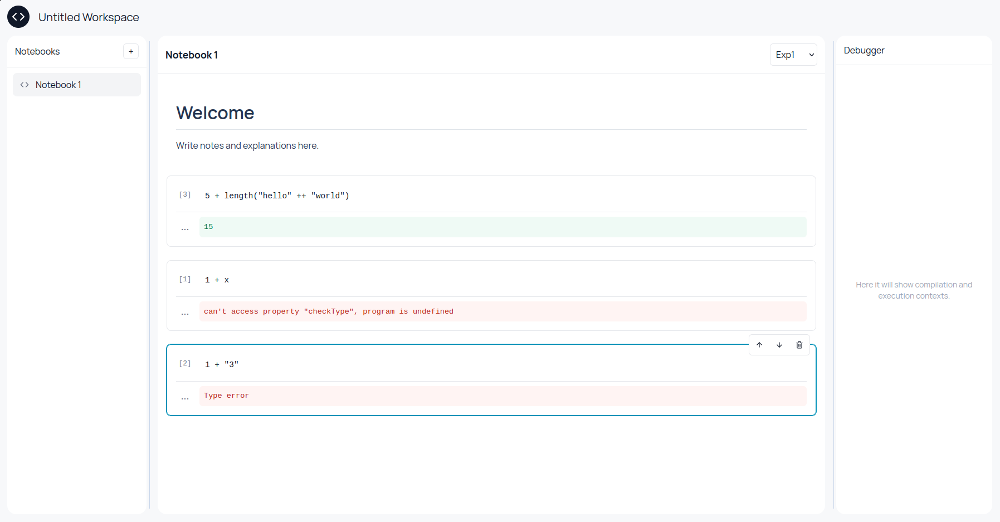

# colab.io

Web-based IDE para a disciplina de Paradigmas de Linguagens de Programação

  

🔗 Disponível em: https://augustosampaio.github.io/PLP/ide/

---

## Equipe

| Nome | E-mail |
|------|--------|
| Matheus Vinicius Teotonio do Nascimento Andrade | mvtna@cin.ufpe.br |
| Uanderson Ricardo Ferreira da Silva | urfs@cin.ufpe.br |

---

## Sobre o projeto

O **colab.io** é uma IDE web voltada ao exercício dos conceitos e linguagens estudados na disciplina de PLP (Paradigmas de Linguagens de Programação). O ambiente oferece uma interface intuitiva e acessível pelo navegador, permitindo que os alunos escrevam, executem e documentem código de forma incremental, no estilo de notebooks interativos.

A aplicação é inspirada no **Google Colab** e permite criar workspaces com múltiplos notebooks, divididos em células independentes — uma por linguagem, uma por conceito, no ritmo de cada aluno.



---

## Funcionalidades

- 📓 **Notebooks** — Crie workspaces com múltiplos arquivos e organize seu código em células executáveis.
- ▶ **Execução** — Execute código diretamente no navegador, com suporte às linguagens da disciplina.
- 🔤 **Multi-linguagem** — Suporte às nove linguagens de PLP (Exp1, Exp2, Func1-3, Imp1-2, OO1-2).
- 🐞 **Depuração** — Inspecione o ambiente de compilação (pilha de escopos e bindings) de cada execução.
- 📝 **Documentação** — Adicione anotações e documentação junto ao código, em células de texto livre.

---

## Como funciona

Os interpretadores continuam sendo os do Java, neste mesmo repositório. O módulo
[`WebAPI`](../WebAPI) expõe um ponto de entrada único (`plp.web.PlpWebApi`) e é
compilado para JavaScript com [TeaVM](https://teavm.org), gerando `plp.js`. A IDE
carrega esse arquivo e chama `window.__runCode(linguagem, código, entrada)`.

```
Expressoes1..Objetos2 (Java)  →  WebAPI (TeaVM)  →  public/plp.js  →  WebUI (React)
```

---

## Status das linguagens

| Linguagem | Status |
|-----------|--------|
| Exp1, Exp2 | ✅ Suportada |
| Func1, Func2, Func3 | ✅ Suportada |
| Imp1, Imp2 | ✅ Suportada |
| OO1, OO2 | ✅ Suportada |

> As BNFs de todas as linguagens estão disponíveis em: https://augustosampaio.github.io/PLP/linguagens

---

## Exemplos suportados

### Exp1

```txt
1 + 2
```

### Exp2

```txt
let var x = 10, var y = 5 in x - y
```

### Func1

```txt
let fun soma x y = x + y in soma(2,3)
```

### Func2

```txt
let fun add x = fn y . x + y in
	let var id = add(0), var x = 4 in
		id(1) + x
```

---

## Como rodar

Requisitos: JDK 17+, Maven e Node 20+.

```bash
git clone https://github.com/AugustoSampaio/PLP
cd PLP/WebUI
npm install
npm start          # compila o WebAPI (TeaVM) e sobe o Vite em http://localhost:4004
```

O `npm start` equivale a `npm run build:java && npm run dev`. Se `public/plp.js` já
estiver gerado, `npm run dev` é suficiente. Para gerar a versão de produção:

```bash
npm run build:java
npm run build      # saída em WebUI/dist, com base /PLP/ide/
```

O caminho base pode ser trocado com a variável `WEBUI_BASE`
(ex.: `WEBUI_BASE=/ npm run build` para servir na raiz do domínio).

---

## Referências

- 🔗 [Repositório GitHub](https://github.com/AugustoSampaio/PLP)
- 📖 [BNFs das linguagens](https://augustosampaio.github.io/PLP/linguagens)
- 💡 [Inspiração: Google Colab](https://colab.research.google.com)

---

<sub>Universidade Federal de Pernambuco · Centro de Informática · IN1007 2026.1 — Paradigmas de Linguagens de Programação</sub>
